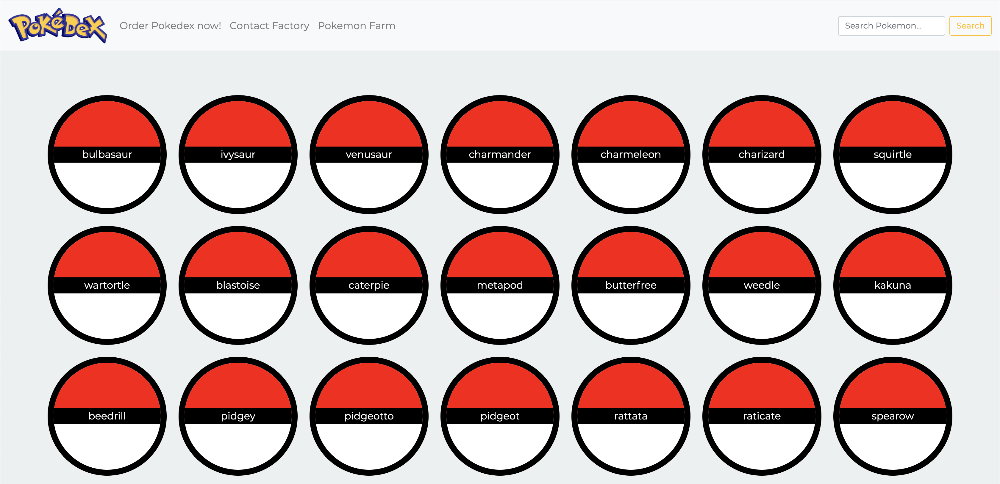

# Pokedex_app
> This is my prototype of a simple app with info about Pokemons. 
> 
> The layout is simple as the goal is,
first and foremost, to have a functional app.

## Built With

- HTML
- CSS
- JavaScript
- https://pokeapi.co/ API.

## 👤 Author

- GitHub: [@orishicha](https://github.com/orishicha)
- LinkedIn: [Anastasiia Zelenova](https://www.linkedin.com/in/anastasiia-zelenova/)

## User Goals
Users should be able to view a list of data and see more details for a given data item on
demand. 
Functions: 
- load data from API, 
- show moidal with additional info about pokemons,
- perform search,
- go back to top of the page.

## Show your support

Give a ⭐️ if you like this project!

## Acknowledgments

- CareerFoundry tutors, mentors and fellow students;
- Contents: https://pokeapi.co/ API;
- Pokeball button inspiration: https://github.com/athanstan;
- Back to top button: https://mdbootstrap.com/.

## 📝 License

This project is [MIT](./LICENSE) licensed.
